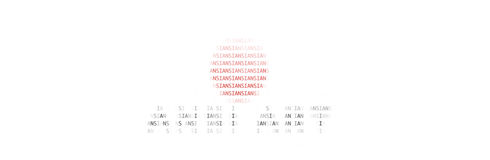

# ANSI-Art

**NOTE:** This toy project is not yet finished.

## ANSI-version Logo

## Support Platform

You are kindly reminded to refer to [this](https://gist.github.com/XVilka/8346728) Github Gist
to check whether your terminal meets the requirements to run ANSI-art. For the colored version,
we rely on the "true color" of the terminal to preserve the initial RGB values. There are many
terminal apps that supports true color, I recommend you to use [iTerm2](https://iterm2.com/). However,
it is sad to know that MacOS' terminal builtin ([Terminal.app](https://en.wikipedia.org/wiki/Terminal_(macOS))) does not support it. Don't run ANSI-art on
it unless you are expecting a mess on your screen.

I also plan to support plain ascii art, but it is not finished yet.

## Reference

* [Image to ASCII art conversion](https://stackoverflow.com/questions/32987103/image-to-ascii-art-conversion)
* [Converting images to ASCII art (Part 1)](https://bitesofcode.wordpress.com/2017/01/19/converting-images-to-ascii-art-part-1/)
* [Converting images to ASCII art (Part 2)](https://bitesofcode.wordpress.com/2017/05/27/converting-images-to-ascii-art-part-2/)

