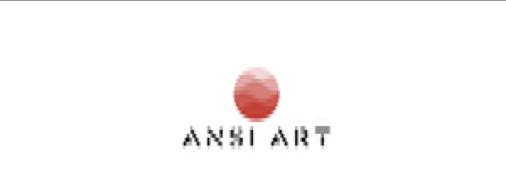
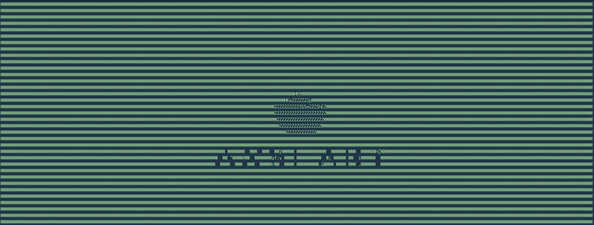
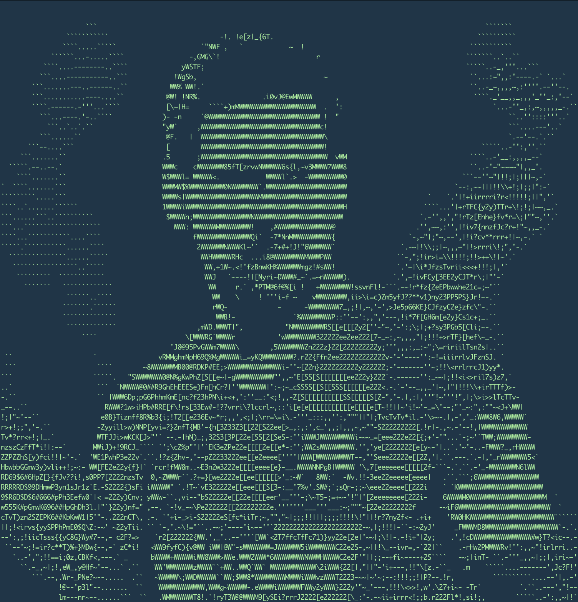
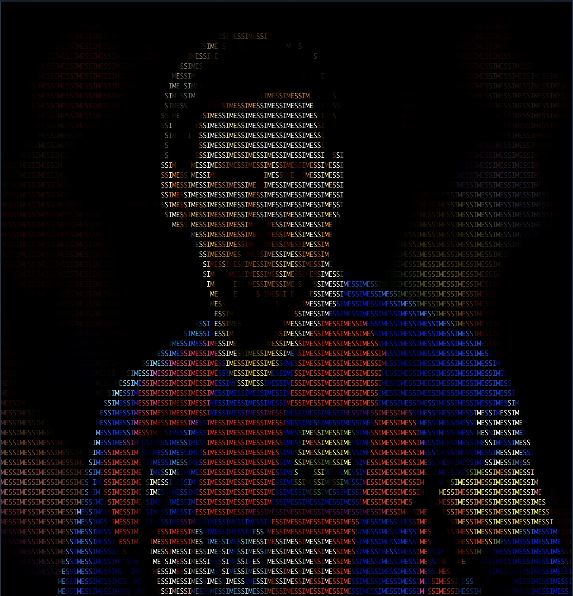
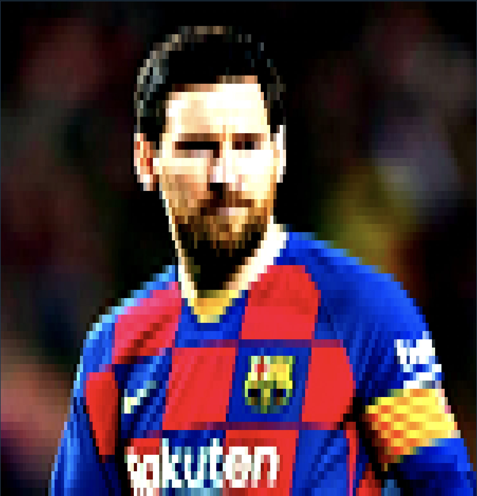

# ANSI-Art


**NOTE:** This toy project is not yet finished.


## ANSI-version Logo


## Block ANSI-version Logo


## ASCII-version Logo


## Support Platform

You are kindly reminded to refer to [this](https://gist.github.com/XVilka/8346728) Github Gist
to check whether your terminal meets the requirements to run ANSI-art. For the colored version,
we rely on the "true color" of the terminal to preserve the initial RGB values. There are many
terminal apps that supports true color, I recommend you to use [iTerm2](https://iterm2.com/). However,
it is sad to know that MacOS' terminal builtin ([Terminal.app](https://en.wikipedia.org/wiki/Terminal_(macOS))) does not support it. Don't run ANSI-art on
it unless you are expecting a mess on your screen.

For the ASCII art version, this true color feature is not required.

## Usage
To build the project and get the executable:
```shell
$ cd ANSI-art
$ go build -o ansi-art main.go
```
Then, with command `./ansi-art --help` you will get the following help info:
```text
ANSI-Art converts your image & Gif to ANSI characters (with color) that can show in the console.
Users can speicify the characters to use, size of the image, etc to get the best results. some sample commands are:

./ansi-art image pic/messi.png -W 150 -H 60 -a -C 40
./ansi-art gif pic/sharingan.gif -W 150 -H 60 -s SASUKE -d 300 -m bgm/uefa.mp3

Usage:
  ansi-art [command]

Available Commands:
  completion  generate the autocompletion script for the specified shell
  gif         Playing gif in your terminal.
  help        Help about any command
  image       Show your image in the terminal.

Flags:
  -h, --help   help for ansi-art
```
Now we look into subcommands.
### Image
With Command `./ansi-art image --help`, the following are displayed:
```text
Show your image in the terminal.

Usage:
  ansi-art image [flags]

Flags:
  -a, --ascii             ansi or ascii art
  -b, --blockMode         character or block mode
  -C, --contrast float    increase/decrease the imgContrast (-100 ~ 100)
  -f, --filename string   the input gif file (default "demo.gif")
  -H, --height int        the resized height of the image (default 100)
  -h, --help              help for image
  -s, --seq string        the string of ANSI chars that build the image (default "01")
  -S, --sigma float       sharpening factor
  -W, --width int         the resized width of the image (default 100)
```
So a valid command can be:
```shell
./ansi-art image -f pic/messi.png -W 150 -H 60 -C 20 -S 10 -a
```
The output of this command is as follows:

or 
```shell
/ansi-art image -f pic/messi.png -W 150 -H 60 -C 20 -S 10 -s MESSI
```
This time the result is:

Or you can add a `-b` command to the nearest above command to get the pixel version:

**NOTE that these are all displayed IN YOUR TERMINAL!** 
(We will provide an export to image function later for sure though.)
One last thing to remind is that `--seq` is only effective when no `-a` or `-b` is 
specified; when `-a` and `-b` show together, `-a` is of higher priority.
### Gif
These are the output of command `./ansi-art gif --help`:
```text
Playing gif in your terminal.

Usage:
  ansi-art gif [flags]

Flags:
  -a, --ascii             ansi or ascii art
  -b, --blockMode         character or block mode
  -C, --contrast float    increase/decrease the imgContrast (-100 ~ 100)
  -d, --duration int      the duration(ms) of each frame, used to control speed (default 200)
  -f, --filename string   the input gif file (default "pic/demo.gif")
  -H, --height int        the resized height of the image (default 100)
  -h, --help              help for gif
  -L, --loop int          The loop number of the gif (default 1)
  -m, --music string      the background music file (default "bgm/smb.mp3")
  -s, --seq string        the string of ANSI chars that build the image (default "01")
  -S, --sigma float       sharpening factor
  -W, --width int         the resized width of the image (default 100)
```
Most flags are the same as in the image subcommand, with `--duration`, `--loop`, `--duration`, and `--music`
as the new addons. The meaning of each flag is illustrated clearly above.

https://github.com/EtoDemerzel0427/ANSI-art/blob/master/pic/sasuke.mp4
## Reference

* [Image to ASCII art conversion](https://stackoverflow.com/questions/32987103/image-to-ascii-art-conversion)
* [Converting images to ASCII art (Part 1)](https://bitesofcode.wordpress.com/2017/01/19/converting-images-to-ascii-art-part-1/)
* [Converting images to ASCII art (Part 2)](https://bitesofcode.wordpress.com/2017/05/27/converting-images-to-ascii-art-part-2/)


